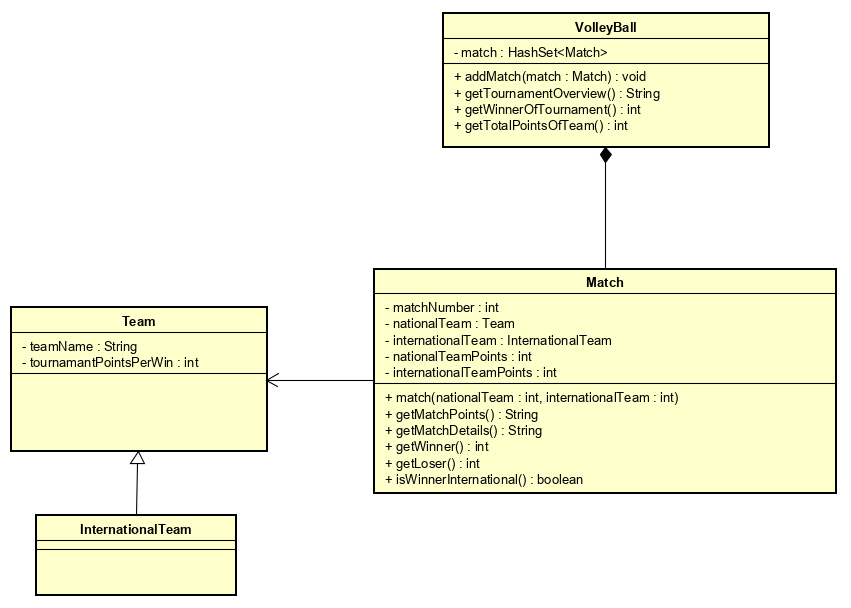

#Volleyball
## Problem Description

An application is needed for the Dutch volleyball union for registering scores, getting match details and displaying an overview of the tournament. A match has two teams : 
Each team has a status of National or International competing against each other. Winner must score 25 points and above. There must also be a point difference of two between teams playing in a match. The national team earns 3 tournament points when they win, on the other hand, the international team earns 2 tournament points when they win.  
All necessary information about the match needs to be recorded and printed out. An overview of the tournament must be made available for viewing on their website.

## Input and Output

In this section the input and output of the application will be described.

### Input for team

| Case      | Type   | Conditions |
| --------- | ------ | ---------- |
| Team name | String | not empty  |
| Points    | int    | 0 < number |

### Output for team

| Case              | Type   |
| ----------------- | ------ |
| Get team name     | String |
| Point of the team | int    |

### Input for match

| Case               | Type | Conditions |
| ------------------ | ---- | ---------- |
| Match number       | int  | 0 < number |
| national team      | Team | not empty  |
| international team | Team | not empty  |

### Output for match

| Case             | Type |
| ---------------- | ---- |
| Get match number | int  |
| Get winner       | Team |

### Input for Volleyball

| Case      | Type           | Conditions                                          |
| --------- | -------------- | --------------------------------------------------- |
| add match | `HashSet<Match>` | "Match already exist" or "Match added successfully" |

Output for Volleyball

| Case                     | Type   |
| ------------------------ | ------ |
| get winner of tournament | Team   |
| get tournament overview  | String |
| get match hash set       | match  |

### Remarks:
*	Inputs will be validated.
*	Only the "Main" class will contain "System.out.println".
*	Unit Tests will be provided.

## UML

## Testplan

### Test data for Teams

| Team         | Type          |
| ------------ | ------------- |
| South Africa | National      |
| Kenya        | International |
| Ghana        | National      |
| Nigeria      | International |
| Netherlands  | National      |
| Belgium      | International |
| Japan        | National      |
| Korea        | International |

### Test data for Match

| MatchNumber | National Team | International Team |
| ----------- | ------------- | ------------------ |
| 1           | South Africa  | Kenya              |
| 2           | Netherlands   | Belgium            |
| 3           | Ghana         | Nigeria            |
| 4           | Japan         | Korea              |

### Testcases  for Match

#### setPoints

| MatchNumber | Input                                           | Action      |
| ----------- | ----------------------------------------------- | ----------- |
| 1           | 25, 20 *South Africa point, Kenya point.   | setPoints() |
| 2           | 27, 30 *Netherlands points, Belgium points | setPoints() |
| 3           | 26, 23 *Ghana points, Nigeria points       | setPoints() |
| 4           | -1, 0 *Japan points, Korea points          | setPoints() |
| 5           | 29, 35 *Ghana points, Belgium points       | setPoints() |

#### getMatchPoints

| MatchNumber | Action           | Expected Output                 |
| ----------- | ---------------- | ------------------------------- |
| 1           | getMatchPoints() | South Africa : 25 - 20 : Kenya  |
| 2           | getMatchPoints() | Netherlands : 27 - 30 : Belgium |
| 3           | getMatchPoints() | Ghana : 26 - 23 : Nigeria       |
| 4           | getMatchPoints() | No points available yet.        |
| 5           | getMatchPoints() | Ghana : 29 - 35 : Belgium       |

#### getMatchDetails

| MatchNumber | Action            | Expected Output                                              |
| ----------- | ----------------- | ------------------------------------------------------------ |
| 1           | getMatchDetails() | South Africa : 25 - 20 : Kenya Winner is South Africa : 25 Loser is Kenya : 20 |
| 2           | getMatchDetails() | Netherlands : 27 - 30 : Belgium Winner is Belgium : 30 Loser is Netherlands : 27 |
| 3           | getMatchDetails() | Ghana : 26 - 23 : Nigeria Winner is Ghana : 26 Loser is Nigeria : 23 |
| 4           | getMatchDetails() | No winner or loser yet                                       |
| 5           | getMatchDetails() | Ghana : 29 - 35 : Belgium Winner is Belgium : 35 Loser is Ghana : 29 |

#### getWinner

| MatchNumber | Action           | Expected Output                         |
| ----------- | ---------------- | --------------------------------------- |
| 1           | getMatchWinner() | Team{teamName='South Africa', points=3} |
| 2           | getMatchWinner() | Team{teamName='Belgium', points=2}      |
| 3           | getMatchWinner() | Team{teamName='Ghana', points=3}        |
| 4           | getMatchWinner() | null                                    |
| 5           | getMatchWinner() | Team{teamName='Belgium', points=2}      |

getLoser

| MatchNumber | Action     | Expected Output                        |
| ----------- | ---------- | -------------------------------------- |
| 1           | getLoser() | Team{teamName='Kenya', points=0}       |
| 2           | getLoser() | Team{teamName='Netherlands', points=0} |
| 3           | getLoser() | Team{teamName='Nigeria', points=0}     |

### Testcases for VolleyBall

#### addMatch

| MatchNumber | Action     | Expected Output           |
| ----------- | ---------- | ------------------------- |
| 1           | addMatch() | Match added successfully. |
| 2           | addMatch() | Match added successfully. |
| 3           | addMatch() | Match added successfully. |
| 4           | addMatch() | Match added successfully. |
| 4           | addMatch() | Match already exist.      |
| 5           | addMatch() | Match added successfully. |

#### getTournamentOverview

| Action                  | Expected Output                                              |
| ----------------------- | ------------------------------------------------------------ |
| getTournamentOverview() | Details for match no. 1 South Africa : 25 - 20 : Kenya Winner is South Africa : 25 Loser is Kenya : 20  Details for match no. 2 Netherlands : 27 - 30 : Belgium Winner is  Belgium : 30 Loser is Netherlands : 27  Details for match no. 3 Ghana : 26 - 23 : Nigeria Winner is Ghana : 26 Loser is Nigeria : 23  Details for match no. 4 No winner or loser yet.  Details for match no. 5 Ghana : 29 - 35 : Belgium Winner is Belgium : 35 Loser is Ghana : 29 |

getTotalPointsOfTeam

| Team    | Action                 | Expected Output |
| ------- | ---------------------- | --------------- |
| Ghana   | getTotalPointsOfTeam() | 3               |
| Belgium | getTotalPointsOfTeam() | 4               |

#### getWinnerOfTournament

| Action                  | Expected Output              |
| ----------------------- | ---------------------------- |
| getWinnerOfTournament() | teamName='Belgium', points=4 |

